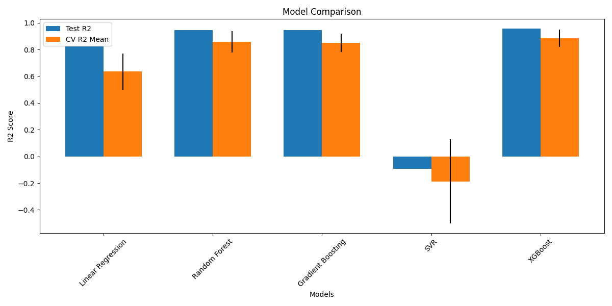
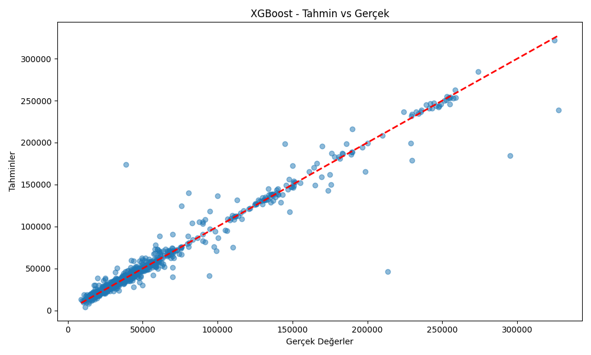
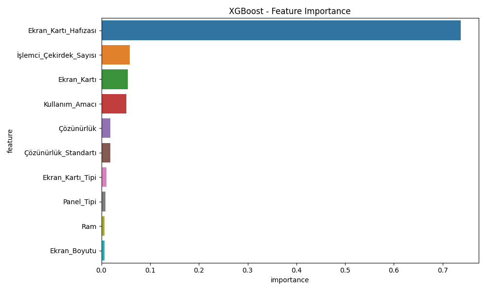
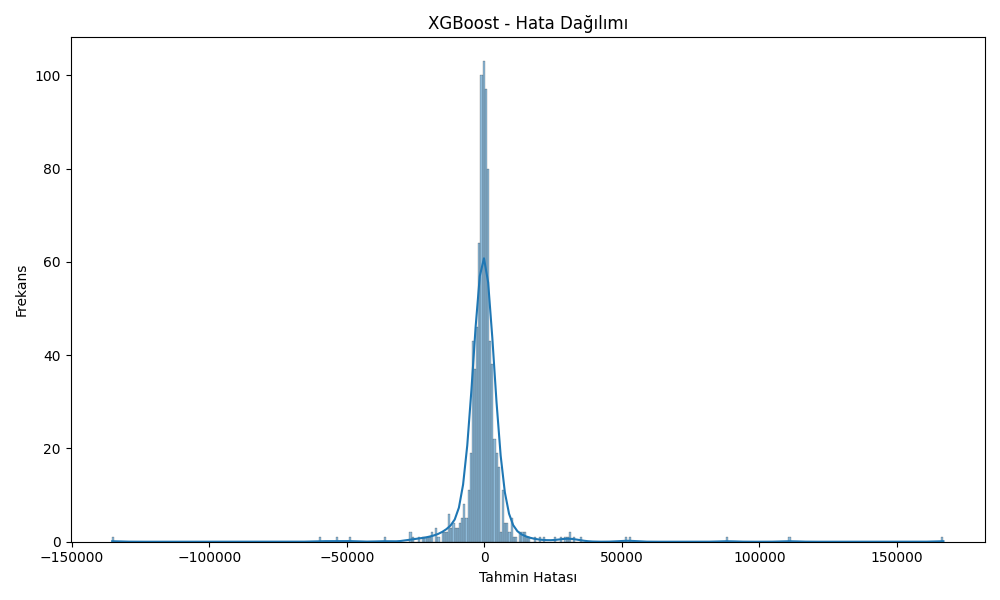

# Laptop Fiyat Tahmin Projesi

Bu proje, laptop özelliklerine göre fiyat tahmini yapan bir makine öğrenmesi modeli ve web arayüzü içermektedir.

## Kurulum ve Çalıştırma

Projeyi yerel makinenizde çalıştırmak için aşağıdaki adımları takip edin:

1. Proje dizinine gidin.

2. `src` klasörüne gidin:
```bash
cd src
```

3. Gerekli paketleri yükleyin:
```bash
pip install -r requirements.txt
```

4. Flask uygulamasını başlatın:
```bash
python app.py
```

5. Tarayıcınızda `http://127.0.0.1:5001` adresine gidin.

---

## Proje Yapısı

```
.
├── data/                   # Veri dosyaları
│   └── doldurulmus_veri.csv
├── docs/                   # Dokümantasyon
│   ├── README.md
│   └── model_comparison_results.csv
├── models/                 # Eğitilmiş modeller ve ilgili dosyalar
│   ├── xgboost_model.joblib
│   ├── label_encoders.joblib
│   ├── categorical_columns.json
│   └── feature_names.json
├── src/                    # Kaynak kodlar
│   ├── app.py
│   ├── model_testing.py
│   └── requirements.txt
├── static/                 # Statik dosyalar (görseller)
│   ├── model_comparison.png
│   ├── best_model_predictions.png
│   ├── error_distribution.png
│   └── *_feature_importance.png
└── templates/             # Web şablonları
    └── index.html
```

## Proje İçeriği

- [Proje Hakkında](#proje-hakkında)
- [Veri Seti](#veri-seti)
- [Model Geliştirme](#model-geliştirme)
- [Web Arayüzü](#web-arayüzü)
- [Kullanım](#kullanım)
- [Model Performansı](#model-performansı)
- [Sonuçlar ve Değerlendirme](#sonuçlar-ve-değerlendirme)

## Proje Hakkında

Bu proje, laptop özelliklerini kullanarak fiyat tahmini yapan bir makine öğrenmesi modeli geliştirmeyi ve bu modeli kullanıcı dostu bir web arayüzü ile sunmayı amaçlamaktadır. Proje, veri toplama, veri ön işleme, model geliştirme ve web arayüzü geliştirme aşamalarını içermektedir.\n\n## Veri Seti\n\nProjede kullanılan veri seti, çeşitli laptop özelliklerini ve fiyatlarını içermektedir. Veri setinde şu özellikler bulunmaktadır:\n\n- Marka (brand)\n- İşlemci modeli\n- RAM miktarı\n- SSD kapasitesi\n- Ekran kartı\n- Ekran kartı hafızası\n- İşlemci çekirdek sayısı\n- Temel işlemci hızı\n- Maksimum işlemci hızı\n- Ekran yenileme hızı\n- İşletim sistemi\n\n## Model Geliştirme\n\nProjede farklı makine öğrenmesi modelleri test edilmiş ve en iyi performans gösteren model seçilmiştir. Test edilen modeller:\n\n1. Linear Regression\n2. Random Forest\n3. Gradient Boosting\n4. SVR (Support Vector Regression)\n5. XGBoost\n\n### Model Karşılaştırması\n\n\n\nModel performans karşılaştırması sonuçları:\n\n| Model | R2 Score | RMSE | CV R2 Mean |\n|-------|----------|------|------------|\n| XGBoost | 0.95 | 12,485.58 | 0.86 |\n| Random Forest | 0.93 | 14,049.15 | 0.85 |\n| Gradient Boosting | 0.92 | 14,687.80 | 0.84 |\n| Linear Regression | 0.76 | 26,431.92 | 0.63 |\n| SVR | -0.09 | 55,859.70 | -0.15 |\n\n### En İyi Model: XGBoost\n\nXGBoost modeli, en yüksek R2 skoru (0.95) ve en düşük RMSE değeri (12,485.58) ile en iyi performansı göstermiştir.\n\n\n\n### Özellik Önemliliği\n\n\n\n## Web Arayüzü\n\nProje, Flask web framework\'ü kullanılarak geliştirilmiş bir web arayüzü içermektedir. Arayüz, kullanıcıların laptop özelliklerini girmesine ve fiyat tahmini almasına olanak sağlar.\n\n### Arayüz Özellikleri\n\n- Kullanıcı dostu form tasarımı\n- Kategorik veriler için dropdown menüler\n- Sayısal veriler için input alanları\n- Anlık fiyat tahmini\n- Responsive tasarım\n\n## Kullanım\n\n1. Web arayüzünde laptop özelliklerini girin\n2. Kategorik veriler için dropdown menülerden seçim yapın\n3. Sayısal veriler için uygun değerleri girin\n4. \"Tahmin Et\" butonuna tıklayın\n5. Tahmin edilen fiyatı görüntüleyin\n\n## Model Performansı\n\n### Tahmin vs Gerçek Değer Grafiği\n\n\n\n### Hata Dağılımı\n\n\n\n## Sonuçlar ve Değerlendirme\n\n- XGBoost modeli %95 doğruluk oranı ile en iyi performansı göstermiştir\n- Cross-validation sonuçları modelin güvenilirliğini doğrulamaktadır\n- Hata dağılımı analizi, modelin tutarlı tahminler yaptığını göstermektedir\n- Web arayüzü, modelin kullanımını kolaylaştırmaktadır\n\n## Gelecek Geliştirmeler\n\n1. Model performansını artırmak için hiperparametre optimizasyonu\n2. Daha fazla özellik ekleme\n3. Kullanıcı geri bildirimleri ile model güncelleme\n4. Arayüz geliştirmeleri ve yeni özellikler ekleme 